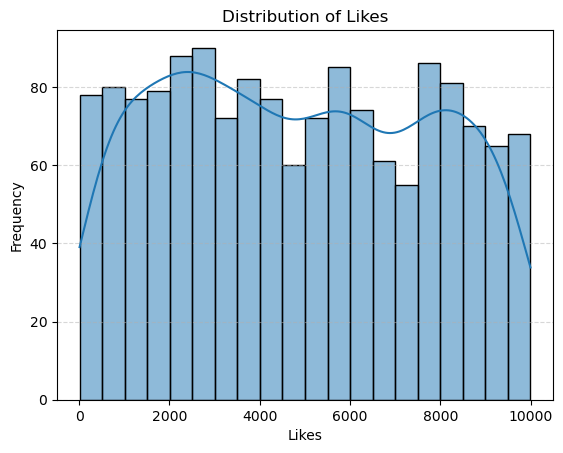
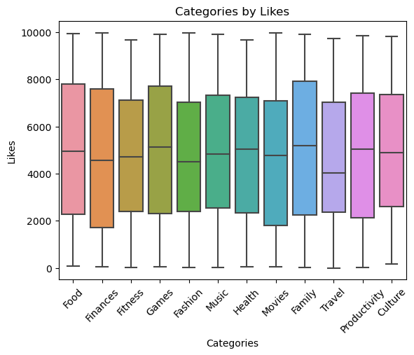
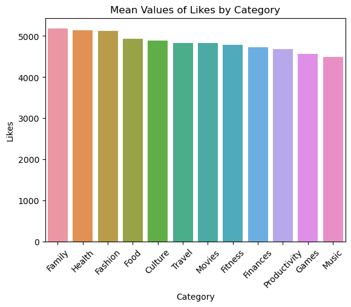

# Clean and analyze social media usage data with Python

## Overview
This repository contains the project developed during the "Clean and Analyze Social Media Usage Data With Python" course offered by the Coursera Project Network, which can be accessed at the following link: https://www.coursera.org/projects/analyze-social-media-python

Here, we perform data cleaning and analysis of a social media dataset, and also present insights gained from these processes.

## Business Problem
"Suppose you work for a social media marketing company that specializes in promoting brands and products on a popular social media platform. Your team is responsible for analyzing the performance of different types of posts based on categories, such as health, family, food, etc. to help clients optimize their social media strategy and increase their reach and engagement.

They want you to use Python to automatically extract tweets posted from one or more categories, and to clean, analyze and visualize the data. The team will use your analysis to  making data-driven recommendations to clients to improve their social media performance. This feature will help the marketing agency deliver tweets on time, within budget, and gain fast results.

Your task will be taking on the role of a social media analyst responsible for collecting, cleaning, and analyzing data on a client's social media posts. You will also be responsible for communicating the insights and making data-driven recommendations to clients to improve their social media performance. To do this, you will  set up the environment, identify the categories for the post (fitness, tech, family, beauty, etc) process, analyze, and visualize data."

## Objectives
1. Increase client reach and engagement

2. Gain valuable insights that will help improve social media performance

3. Achieve their social media goals and provide data-driven recommendations

## Variables
|   Category   |   Description                                       |
|-------------- |---------------------------------------------------  |
| Date          | Day, Month, and Year that a post was made                |
| Category      | Category on which a post was classified             |
| Likes         | Number of Likes that a post received                |

## Solution Planning
The project it required us not to extract data but to generate this data using the 'Random' module in Python. Data import and manipulation will be done using the Pandas library, and visualization will be performed using the Seaborn and Matplotlib libraries, with analysis using measures of mean and median, all orchestrated using the Jupyter notebook.

## Tools Used
- Python - 3.11.5
- Matplotlib - 3.7.2
- Numpy - 1.26.0
- Pandas - 2.0.3
- Seaborn - 0.12.2
- VS Code
- Jupyter Notebook
- Git and GitHub

## Top Data Insights and Conclusion
1. A higher concentration of values was found in posts with likes ranging from 1500 to 3000. This number remains reasonably consistent between 60 and 80, but the peak is between 2000 and 3000. Any action aimed at maximizing visibility on Twitter should target posts from profiles that maintain this average.

  

2. Although the categories have similar distributions, the central tendency differs significantly, and overall, posts related to 'Health' have a higher median than the other categories.

  

3. The top 3 average values by post category are: 'Family', 'Health', 'Fashion', actions focusing on these three categories have the best visibility for our company's products.

  

These are basic insights after the analysis of the collected data. More data can be gathered from different social networks and compared with the available categories, so the company can take actions based on new analyses. Focusing on actions within the categories of Family, Health, and Fashion seems to be a good approach, but do these categories exhibit the same consistency in data across other social networks?